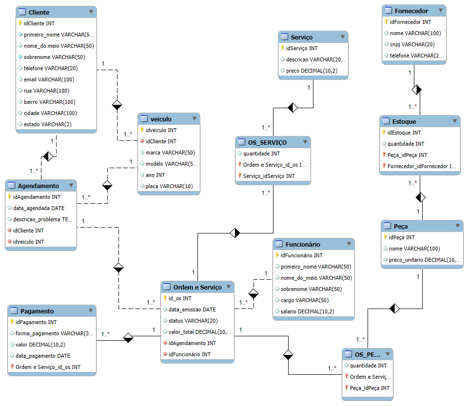

# projeto-banco-de-dados-oficina

# 🛠️ Projeto de Banco de Dados — Oficina Mecânica  
Desenvolvido para o desafio de projeto do módulo de Banco de Dados.  
Este repositório contém **modelagem, criação do banco, inserção de dados, queries e documentação completa** de um sistema de gestão para uma **Oficina Mecânica**.

---

## ✅ 1. 📌 Descrição Geral do Projeto

Este projeto tem como objetivo construir um banco de dados completo para gerenciar os processos de uma **oficina mecânica**, incluindo:

- Cadastro de clientes  
- Cadastro de veículos  
- Funcionários (atendentes, mecânicos, gerentes…)
- Fornecedores  
- Peças e controle de estoque  
- Serviços  
- Ordens de serviço (OS)  
- Registro das peças e serviços utilizados  
- Pagamentos  
- Agendamentos  

O banco foi modelado seguindo práticas de normalização, integridade referencial e clareza estrutural.

---

## ✅ 2. 🧩 Modelo Relacional (Lógico)



O modelo relacional implementa as entidades (em português pt-br) e relacionamentos:

| Tabela | Atributos Principais | Relacionamento |
|--------|--------------------|----------------|
| `cliente` | id_cliente, primeiro_nome, nome_meio, sobrenome, rua, bairro, cidade, estado, telefone, email | 1:N com `veiculo`, 1:N com `agendamento` |
| `veiculo` | id_veiculo, id_cliente, marca, modelo, ano, placa | N:1 com `cliente`, 1:N com `agendamento` |
| `funcionario` | id_funcionario, primeiro_nome, nome_meio, sobrenome, cargo, salario | 1:N com `ordem_servico` |
| `agendamento` | id_agendamento, id_cliente, id_veiculo, data_agendada, descricao_problema | N:1 com `cliente`, N:1 com `veiculo`, 1:1 com `ordem_servico` |
| `ordem_servico` | id_ordem_servico, id_agendamento, id_funcionario, data_emissao, status, valor_total | N:1 com `agendamento`, N:1 com `funcionario`, N:N com `servico` e `peca`, 1:N com `pagamento` |
| `servico` | id_servico, descricao, preco | N:N com `ordem_servico` |
| `ordem_servico_servico` | id_ordem_servico, id_servico, quantidade | N:N entre `ordem_servico` e `servico` |
| `peca` | id_peca, nome, preco_unitario | N:N com `ordem_servico`, 1:N com `estoque` |
| `ordem_servico_peca` | id_ordem_servico, id_peca, quantidade | N:N entre `ordem_servico` e `peca` |
| `fornecedor` | id_fornecedor, primeiro_nome, nome_meio, sobrenome, cnpj, telefone | 1:N com `estoque` |
| `estoque` | id_estoque, id_peca, quantidade, id_fornecedor | N:1 com `peca`, N:1 com `fornecedor` |
| `pagamento` | id_pagamento, id_ordem_servico, forma_pagamento, valor, data_pagamento | N:1 com `ordem_servico` |

---

## ✅ 3. 🗄️ Estrutura do Banco (DDL)

O arquivo contém todo o script para criação do schema:

✅ Criação do banco  
✅ Tabelas completas  
✅ PK, FK, relacionamentos, cascatas e restrições  
✅ Tipos ENUM representando estados do sistema  
✅ Relacionamentos N:N resolvidos com tabelas associativas

> 📄 Arquivo: [`script_oficina_tables.sql`](SQL/script_oficina_tables.sql)  

---

## ✅ 4. 🧪 Inserts de Teste (DML)

Foram criados **8 a 10 registros por tabela**, garantindo volume suficiente para testes de consultas, junções e agrupamentos.

As tabelas preenchidas incluem:

- Cliente  
- Funcionario  
- Veiculo  
- Fornecedor  
- Peca  
- Estoque  
- Servico  
- OrdemServico  
- OrdemItemServico  
- OrdemItemPeca  
- Pagamento  
- Agendamento  

> 📄 Arquivo: [`script_oficina_inserts.sql`](SQL/script_oficina_inserts.sql)

### 🔹 Modelo Relacional Resumido

Abaixo está uma visão geral das entidades, atributos principais e relacionamentos do banco:

| Table | Key Attributes | Relationship |
|-------|----------------|--------------|
| `client` | id_client, first_name, middle_name, last_name, street, district, city, state, phone, email | 1:N with `vehicle`, 1:N with `appointment` |
| `vehicle` | id_vehicle, id_client, brand, model, year, plate | N:1 with `client`, 1:N with `appointment` |
| `employee` | id_employee, first_name, middle_name, last_name, role, salary | 1:N with `service_order` |
| `appointment` | id_appointment, id_client, id_vehicle, appointment_date, problem_description | N:1 with `client`, N:1 with `vehicle`, 1:1 with `service_order` |
| `service_order` | id_service_order, id_appointment, id_employee, issue_date, status, total_value | N:1 with `appointment`, N:1 with `employee`, N:N with `service` via `service_order_service`, N:N with `part` via `service_order_part`, 1:N with `payment` |
| `service` | id_service, description, price | N:N with `service_order` via `service_order_service` |
| `service_order_service` | id_service_order, id_service, quantity | N:N bridge between `service_order` and `service` |
| `part` | id_part, name, unit_price | N:N with `service_order` via `service_order_part`, 1:N with `stock` |
| `service_order_part` | id_service_order, id_part, quantity | N:N bridge between `service_order` and `part` |
| `supplier` | id_supplier, first_name, middle_name, last_name, cnpj, phone | 1:N with `stock` |
| `stock` | id_stock, id_part, quantity, id_supplier | N:1 with `part`, N:1 with `supplier` |
| `payment` | id_payment, id_service_order, payment_method, amount, payment_date | N:1 with `service_order` |

---

## ✅ 5. 🔍 Queries Solicitadas no Desafio

Foram criadas queries completas utilizando:

✅ SELECT  
✅ WHERE  
✅ ORDER BY  
✅ HAVING  
✅ JOIN  
✅ GROUP BY  
✅ Subqueries  
✅ Expressões derivadas  
✅ Views  
✅ Consultas extras mais avançadas  

> 📄 Arquivo: [`script_oficina_queries.sql`](SQL/script_oficina_queries.sql)  

---

## ✅ 6. 📊 Exemplos de Perguntas Respondidas

Algumas perguntas que as queries permitem responder:

- Quais clientes têm veículos cadastrados?  
- Quanto cada serviço faturou no mês?  
- Quais OS utilizam peças específicas?  
- Qual o estoque total da oficina?  
- Quanto foi gasto em peças por ordem de serviço?  
- Quais funcionários estão ativos atualmente?  
- Qual a previsão de faturamento da oficina por forma de pagamento?  
- Quais serviços foram executados em cada OS?  
- Quais clientes possuem agendamentos futuros?

---

## ✅ 7. 🧠 Regras de Negócio Consideradas

- Uma OS sempre possui: cliente, veículo, atendente e mecânico.  
- Uma OS pode ter **vários serviços** e **várias peças**.  
- Cada peça pertence a **um fornecedor**.  
- Cada peça possui um registro único de estoque (relação 1:1).  
- Um cliente pode ter vários veículos.  
- Pagamentos estão ligados diretamente à OS.  
- Agendamentos vinculam cliente + veículo + serviço.  
- Funcionários têm cargos pré-definidos (ENUM).

---

## ✅ 8. 🏗️ Tecnologias Utilizadas

- ✅ **MySQL 8+**  
- ✅ **Workbench**  
- ✅ Scripts SQL  
- ✅ Markdown para documentação

---

## ✅ 9. 📁 Estrutura do Repositório

```text
📦 oficina-mecanica-mysql
├── README.md
├── sql/
│   ├── script_oficina_tables.sql      ← Criação das tabelas
│   ├── script_oficina_inserts.sql     ← Inserts com dados de teste
│   └── script_oficina_queries.sql     ← Queries obrigatórias e extras
└── docs/
    └── modelo_oficina.png             ← Modelo relacional da oficina

````

---

## ✅ 10. 👩‍💻 Autor(a)

Projeto desenvolvido por **Joana Cristina C. Silva** ✨  
Como parte do desafio do módulo de Banco de Dados, curso: DIO.

---

## ✅ 11. Status do Projeto

🟩 **Concluído e funcionando.**  
Scripts testados e validados.

---

## ✅ 12. 📜 Licença

Este projeto é livre para uso acadêmico e estudos.

---

## 🚀 Como usar

Clone o repositório:

```bash
git clone https://github.com/joanacristinacs/projeto-banco-de-dados-oficina.git
```

Acesse a pasta do projeto:

```bash
cd projeto-banco-de-dados-oficina/sql
```
Execute os scripts no MySQL:

-- Criar banco e tabelas
source script_oficina_tables.sql;

-- Inserir dados de teste
source script_oficina_inserts.sql;

-- Executar queries
source script_oficina_queries.sql;

